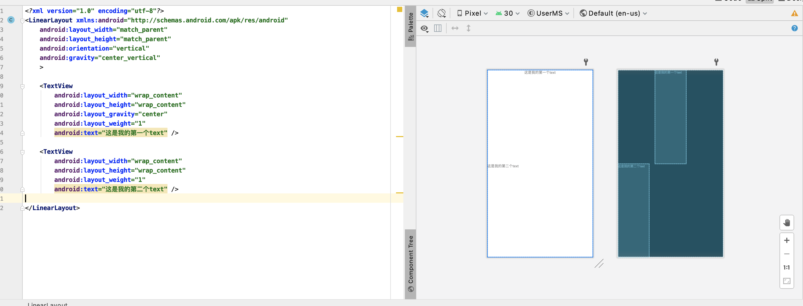
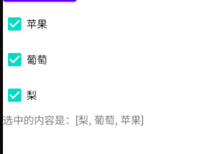
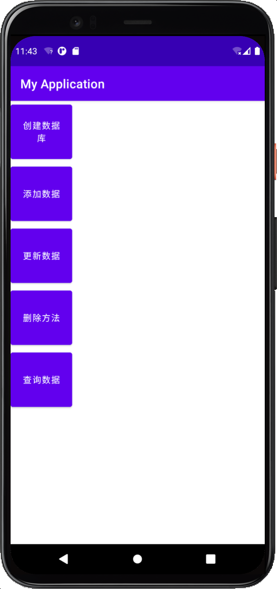

## 第一章：Android系统简介和环境搭建

环境搭建是真的难...，我这里用的是 android Studio Mac 版本

---

## 第二章：Android基础UI使用

> 布局管理器之间的继承关系：布局管理器都是以ViewGroup（视图组，这个是通过View继承来的）为基类派生出来的，使用布局管理器可以适配不同手机屏幕的分辨率，尺寸大小

---

### 🔥 第一节：Android布局（线性布局）

> 线性布局（LinearLayout）：按照垂直或者水平方向布局的组件

通过 android:orientation 属性设置线性布局方向

通用属性（每个控件都要设置的）

- android:layout_width="wrap_content"  当前组件的宽度
    - 值：wrap_content：包裹内容
    - 值：match_parent：匹配父控件
- android:layout_height="wrap_content" 当前组件的高度
    - 值：wrap_content：包裹内容
    - 值：match_parent：匹配父控件
- android:orientation 设置布局方向
    - horizontal：按照水平方向摆放
    - vertical：垂直摆放
- android:gravity 用来控制组件的对齐方式
- android:layout_gravity 设置的是本身的对齐方式
- layout_weight 控制各个组件在布局中的相对大小
- android:padding：内边距
    - android:paddingTop="50dp" ：内边距（顶部）
    - ...
    - android：padding="" ：内边距（四个方向，和css类似）
- android:layout_margin：外边距
    - android:layout_marginTop="50dp"：外边距（顶部）
    - ...
    - android:layout_margin（四个方向）

---

非通用布局

- android:gravity：控制容器内子控件的方向
    - 值：left,right,top,bottom
    - top|right（两个属性一起加，右上）
    - center(垂直水平居中)，center_horizontal（水平居中），center_vertical（垂直居中）
- android:layout_gravity：设置本身的方向（常用在子组件中，取值方向和android:gravity一样）
- 权重布局：等分，类似于css栅格布局（值越大，占用的空间越大）
    - android:layout_weight="1"
    - android:layout_height="1"

---

常用单位

- 设置长宽的时候，dp（dip）
- 使用字体的时候，使用sp
- in：表示英寸（屏幕物理尺寸）
- mm：表示毫米（屏幕物理尺寸）
- pt：表示一个点（屏幕物理尺寸）

---

```xml
<?xml version="1.0" encoding="utf-8"?>
<LinearLayout xmlns:android="http://schemas.android.com/apk/res/android"
    android:layout_width="match_parent"
    android:layout_height="match_parent"
    android:orientation="vertical"
    android:gravity="center_vertical"
    >

    <TextView
        android:layout_width="wrap_content"
        android:layout_height="wrap_content"
        android:layout_gravity="center"
        android:layout_weight="1"
        android:text="这是我的第一个text" />

    <TextView
        android:layout_width="wrap_content"
        android:layout_height="wrap_content"
        android:layout_weight="1"
        android:text="这是我的第二个text" />

</LinearLayout>
```



---

### 🔥 第二节：Android布局（相对布局）

> 相对布局（RelativeLayout）：相对其他

---

### 🔥 第三节：Android布局（帧布局）

> 帧布局（FrameLayout）：组件从屏幕左上方布局组件

---

### 第四节：Android布局（绝对布局）

> 绝对布局（AbsoluteLayout）：按照绝对坐标来布局组件

---


### 第五节：Android布局（表格布局）

> 表格布局（TableLayout）：按照行列方式布局组件

---

### 第六节：TextView（）

---

### 第七节：EditText（）

---

### 第八节：Button（按钮）

---

### 第九节：ImageView（图片组件）

---

### 第十节：spinner组件（下拉列表）

---
### 第十一节：RadioButton（单选按钮）


---

### 第十二节：checkBox（多选按钮）



```xml
<!-- android:checked="true" -->
<CheckBox
    android:id="@+id/checkBox_Apple"
    android:layout_width="wrap_content"
    android:layout_height="wrap_content"
    android:onClick="choose"
    android:text="苹果" />

<CheckBox
    android:id="@+id/checkBox_Apple"
    android:layout_width="wrap_content"
    android:layout_height="wrap_content"
    android:onClick="choose"
    android:text="葡萄" />

<CheckBox
    android:id="@+id/checkBox_Apple"
    android:layout_width="wrap_content"
    android:layout_height="wrap_content"
    android:onClick="choose"
    android:text="梨" />

<TextView
    android:id="@+id/textViewResult"
    android:layout_width="wrap_content"
    android:layout_height="wrap_content" />
```

---

### 第十三节：ListView和适配器使用（列表）


---

```java
public class MainActivity extends AppCompatActivity {

    private TextView textViewResult;
    // 主要存放结果的集合
    private List<String> lists = new ArrayList<String>();

    @Override
    protected void onCreate(Bundle savedInstanceState) {
        super.onCreate(savedInstanceState);
        setContentView(R.layout.activity_main);
        textViewResult = (TextView)findViewById(R.id.textViewResult);
    }

    // 通过点击事件进行监听
    public void choose(View view) {
        // 得到View对象 ---> Checkbox
        CheckBox checkBox = (CheckBox) view;
        // 获取checkBox状态
        boolean isChecked = checkBox.isChecked();
        // 将这个结果添加到集合中
        if (isChecked) {
            lists.add(checkBox.getText().toString()); // 选中
        } else {
            lists.remove(checkBox.getText().toString()); // 没有选中
        }

        // 展示结果
        textViewResult.setText("选中的内容是：" + lists.toString());
    }

}

```

---

### 第十四节：GridView（网格视图）

---

## 第三章：Activity的生命周期和传值

---

## 第四章：异步任务AsyncTask的应用

---

## 第五章：Android数据存储

> 如果你不想手机关机之后数据就没有了，那么你将需要数据存储（）

---

### 第一节：SharedPreferences存储数据

---

### 第二节：内部存储

---

### 第三节：外部存储

---

### 第四节：数据库存储

> SQLite数据库存储（轻量级嵌入式关系数据库，Android已经继承了这个库）



```xml
<?xml version="1.0" encoding="utf-8"?>
<LinearLayout xmlns:android="http://schemas.android.com/apk/res/android"
    xmlns:app="http://schemas.android.com/apk/res-auto"
    xmlns:tools="http://schemas.android.com/tools"
    android:layout_width="match_parent"
    android:layout_height="match_parent"
    android:orientation="vertical"
    tools:context=".MainActivity">

    <Button
        android:layout_width="100dp"
        android:layout_height="100dp"
        android:onClick="createDb"
        android:text="创建数据库" />

    <Button
        android:id="@+id/buttonInsert"
        android:layout_width="100dp"
        android:layout_height="100dp"
        android:onClick="insertData"
        android:text="添加数据" />

    <Button
        android:id="@+id/buttonUpadte"
        android:layout_width="100dp"
        android:layout_height="100dp"
        android:onClick="updateData"
        android:text="更新数据" />

    <Button
        android:id="@+id/buttonDelete"
        android:layout_width="100dp"
        android:layout_height="100dp"
        android:onClick="deleteData"
        android:text="删除方法" />

    <Button
        android:id="@+id/buttonQuery"
        android:layout_width="100dp"
        android:layout_height="100dp"
        android:onClick="queryData"
        android:text="查询数据" />
</LinearLayout>
```

---

MainActivity

```java
package com.example.myapplication;

import androidx.appcompat.app.AppCompatActivity;

import android.content.ContentValues;
import android.database.Cursor;
import android.database.sqlite.SQLiteDatabase;
import android.os.Bundle;
import android.util.Log;
import android.view.View;
import android.widget.Toast;

import java.security.Key;

public class MainActivity extends AppCompatActivity {

    private MyOpenHelper helper;

    @Override
    protected void onCreate(Bundle savedInstanceState) {
        super.onCreate(savedInstanceState);
        setContentView(R.layout.activity_main);
        helper = new MyOpenHelper(this);
    }

    // 创建数据库
    public void createDb(View view) {
        SQLiteDatabase db = helper.getReadableDatabase();
        Log.i("aaa", "点击按键创建数据库");
    }

    // 向表中添加数据
    public void insertData(View view) {
        Log.i("aaa", "点击按键创建数据库");

        SQLiteDatabase db = helper.getWritableDatabase();

        // 第一种方法：sql语句
         String sql = "insert into employee values(123, '朱昆鹏', 23, '男')";
         db.execSQL(sql);

        // 第二种方法：
        // ContentValues values = new ContentValues();
        // values.put("'_id'", 21);
        // values.put("name", "朱昆鹏");
        // values.put("age", 23);
        // values.put("gender", "男");
        // db.insert("employee", null, values);

        Toast.makeText(this, "添加数据完成", Toast.LENGTH_LONG).show();
    }

    // 更新数据
    public void updateData(View view) {
        SQLiteDatabase db = helper.getWritableDatabase();

        // 第一种方法：sql语句
        // String sql = "update employee set age=30 where _id=1";
        // db.execSQL(sql);

        // 第二种方法：
        ContentValues values = new ContentValues();
        values.put("age", 30);
        int row = db.update("employee", values, "name=?", new String[]{"朱昆鹏"});
        Toast.makeText(this, "更新数据完成--->" + row, Toast.LENGTH_LONG).show();
    }

    // 删除数据
    public void deleteData(View view) {
        SQLiteDatabase db = helper.getWritableDatabase();

        // 第一种方法：sql语句
        // String sql = "delete from employee where name='朱昆鹏'";
        // db.execSQL(sql);

        // 第二种方法
        int row = db.delete("employee", "name=?", new String[]{"朱昆鹏"});

        Toast.makeText(this, "删除数据完成--->" + row, Toast.LENGTH_LONG).show();
    }

    // 查询方法
    public void queryData(View view) {
        SQLiteDatabase db = helper.getReadableDatabase();

        // 参数：表明，列名，...
        Cursor c = db.query("employee", null, null, null, null, null, null);

        // 遍历Cursor
        while (c.moveToNext()) {
            int index = c.getColumnIndex("name");
            String name = c.getString(index);

            int age = c.getInt(c.getColumnIndex("age")); // 获取年龄
            String gender = c.getString(c.getColumnIndex("gender")); // 获取性别

            Log.i("aaa", "===>" + name + "--" + age + "--" + gender);
        }

    }
}
```

---

MyOpenHelper

```java
package com.example.myapplication;

import android.content.Context;
import android.database.sqlite.SQLiteDatabase;
import android.database.sqlite.SQLiteOpenHelper;
import android.util.Log;

import androidx.annotation.Nullable;

public class MyOpenHelper extends SQLiteOpenHelper {
    private final static String TEST = "company";
    private final static int VERSION = 1;

    /**
     * 添加构造方法
     *
     * @param context 上下文环境
     * @param name    数据库名称
     * @param factory 游标工厂
     * @param version 数据库版本
     *
     */
    public MyOpenHelper(@Nullable Context context, @Nullable String name, @Nullable SQLiteDatabase.CursorFactory factory, int version) {
        super(context, name, factory, version);
    }

    public MyOpenHelper(Context context) {
        super(context, TEST, null, VERSION);
    }

    @Override
    public void onCreate(SQLiteDatabase db) {
        // 创建表（id，名字，年龄，性别）
        String sql = "create table employee(_id primary key, name varchar(20), age init, gender char(2))";
        db.execSQL(sql);
        Log.i("aaa", "=============> 创建表成功");
    }

    @Override
    public void onUpgrade(SQLiteDatabase db, int oldVersion, int newVersion) {
        if (newVersion > oldVersion) {
            Log.i("aaa","数据库版本发生更新");
        }
    }
}
```


---

## 第六章：Android 对话框Dialog，菜单Menu，通知Notification

---

## 第七章：Fragment碎片在开发中使用

---

## 第八章：ViewPager介绍和使用

---

## 第九章：Android广播接收器

### 第一节：什么是广播

> 广播是一种在不同应用程序之间传输信息的机制

---

### 第二节：接收广播

---

### 第三节：发送广播

---

## 第十章：Android中Service（服务）


