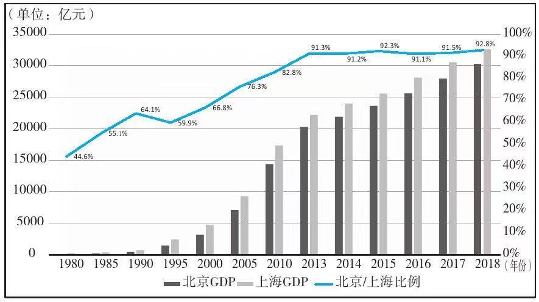

# 中国城市大洗牌

## 1.超级城市，谁更有前途

> 选择一个未来成长的城市，可能比选择一个行业还要重要

我们先来看几个正在改变格局的地方

- 首先是深圳，这里有最完善的电子制造业产业聚集地，拥有强大的竞争力，科技创新带来了人口流动，让深圳成为了中国改革开放的前沿阵地，未来随着人口的不断流入，超越北上也并非不可能。
- 第二个就是雄安，它承担着疏解非首都功能的重任，也就是说北京的经济重心将会转移到雄安（科技，金融等产业），北京作为首都只专注于文化和政治职能。
- 第三个就是南方城市的大量崛起，中国经济的20强，大多数都在南方。
- 第四，都市圈兴起，城市的概念逐渐被打破，例如
    - 深圳带动，东莞 惠州
    - 上海带动 苏州 无锡 南通 嘉兴 宁波 甚至舟山
    - 完全形成一个巨大都市圈，大家发展的都挺好。
- 第五，强省会崛起，一个省的资源开始向省会倾斜，例如 武汉，成都，合肥和西安。

再说北京，北京目前在主动收缩，疏解非首都功能，未来人口将严格控制在一个量级。

再看广州和深圳，在三大都市圈中（京津冀，长三角，粤港澳），属粤港澳大湾区的经济增长潜力最大。

---

## 2.南北差距超过东西差距
