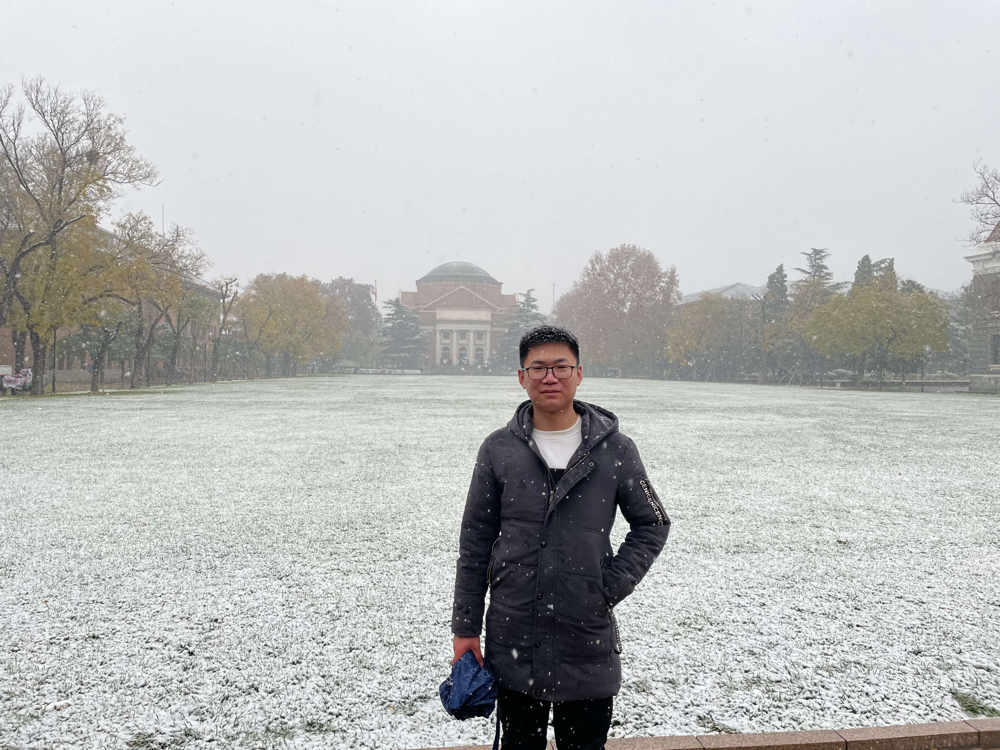
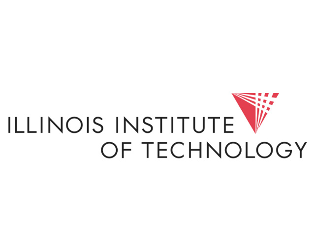

<template>
  

    <main class="resume">
      <section id="introduction">
        <article class="resume-self" id="self">
          <viewer images="./img/ming.jpg">
            
          </viewer>
          
朱昆鹏 Kunpeng Zhu（1998年）

          

            <blockquote>🌈终身学习，学习终身</blockquote>
            <ul class="contact-list">
              <li class="contact-list-item"><a href="https://github.com/zhukunpenglinyutong">GitHub</a></li>
              <li class="contact-list-item"><a href="https://juejin.cn/user/2788017219055175">掘金</a></li>
            </ul>
          

        </article>
      </section>
      <section id="work">
        <h1 class="title">工作</h1>
        
Work

        <article class="resume-work" id="xitu">
          
H5开发工程师

          
<a href="https://www.moqipobing.com/">玩吧</a>

          
2019 - 至今

          

            
负责日常业务开发，人员需求分配，团队协调，前端体系优化，产出效能工具等工作

            
2020年度玩吧大明星（名额是总人数的5%）

          

        </article>
        <article class="resume-work" id="xitu">
            
web前端开发工程师（实习）

            
<a href="https://baike.baidu.com/item/%E5%8C%97%E4%BA%AC%E6%99%BA%E9%9B%A8%E7%89%A9%E8%81%94%E7%A7%91%E6%8A%80%E6%9C%89%E9%99%90%E5%85%AC%E5%8F%B8/19882474?fr=aladdin">智雨物联</a>

            
2018.10 - 2019.7

            

            
主要负责物联网可视化平台搭建工作，前端技术选型，前端体系搭建工作

            

        </article>
      </section>
      <section id="education">
          <h1 class="title">教育经历</h1>
          
Education

          <!-- <article class="resume-education" id="master">
            

                <a target="_blank" href="https://baike.baidu.com/item/%E4%BC%8A%E5%88%A9%E8%AF%BA%E4%BC%8A%E7%90%86%E5%B7%A5%E5%A4%A7%E5%AD%A6/50725025?fr=aladdin">伊利诺伊理工大学 Illinois Institute of Technology</a>（申请中）
            

            
计算机系计算机科学硕士 Computer Science (M.A.S.)

            
2023 - 2024

            

                
美国伊利诺伊理工大学 2020 QS全美综合排第71名，预计2022年拿到本科毕业证之后，申请此学校 M.A.S. 硕士

            

          </article> -->
          <article class="resume-education" id="bachelor">
              

                <a target="_blank" href="https://baike.baidu.com/item/%E4%B8%AD%E5%9B%BD%E4%BA%BA%E6%B0%91%E5%A4%A7%E5%AD%A6">中国人民大学</a>（网络教育本科在读）
              

              
计算机科学与技术 | 工学学士学位

              
2019 - 2022

              

                  
平均成绩：94/100，论文已过，英语已过，2022年3月拿到双证（学位证和学历证）

              

          </article>
          <article class="resume-education" id="bachelor">
              
河北工业职业技术学院（统招专科）

              
计算机系 | 移动应用开发

              
2016 - 2019

              

                  
分数只过了二本线，最终选择报了这个专科学校（河北省内专科计算机第一名，超过我能报的二本院校的计算机水平，之前认为实力更重要，当然后来才发现学历是敲门砖 😢）

                  
学校在2020年10月升为本科（<a target="_blank" href="https://baike.baidu.com/item/%E6%B2%B3%E5%8C%97%E5%B7%A5%E4%B8%9A%E8%81%8C%E4%B8%9A%E6%8A%80%E6%9C%AF%E5%A4%A7%E5%AD%A6/53968503?fromtitle=%E6%B2%B3%E5%8C%97%E5%B7%A5%E4%B8%9A%E8%81%8C%E4%B8%9A%E6%8A%80%E6%9C%AF%E5%AD%A6%E9%99%A2&fromid=465960&fr=aladdin">河北工业职业技术大学</a>），可见学校综合确实不错，符合当时的决定：放弃二本，选择学习技术，当然我后期也会为这个选择买单：1.报名非统本科，2.本科结束后，报名国外全日硕士（国家留服认证）补全学历短板

                  
在校期间的表现：担任班长，软件社团社长，校级学生会干部，获得河北省大数据比赛三等奖，省级优秀毕业生，河北省优秀志愿者，互联网+创新创业大赛河北省二等奖，三级（高级）职业资格证书

              

          </article>
      </section>
    </main>
  

</template>

